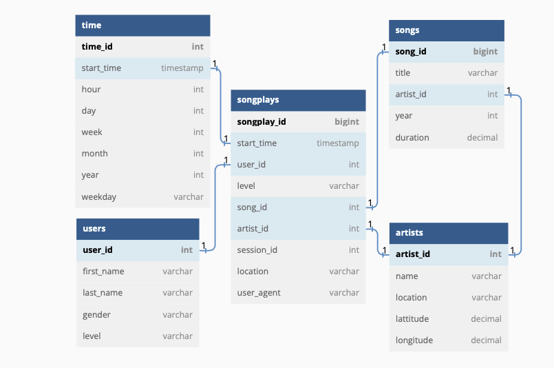
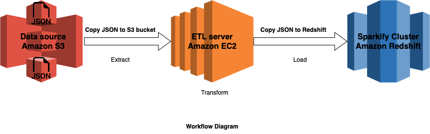

# Sparkify AWS Cloud Data Warehouse

## Introduction
Sparkify, has grown their user base and song database and want to move their processes and data onto the cloud. Their data resides in S3, in a directory of JSON logs on user activity on the app, as well as a directory with JSON metadata on the songs in their app.

## Analytics team request
Analytics team has requested an ETL pipeline that extracts their data from S3, stages it in Redshift, and transforms that data into a set of dimensional tables for them to continue finding insights into what songs users are listening to.

## Datasets
Here are the S3 links:
* Song data: `s3://udacity-dend/song_data`
* Log data: `s3://udacity-dend/log_data`
* This third file `s3://udacity-dend/log_json_path.json` contains the meta information that is required by AWS to correctly load `s3://udacity-dend/log_data`

### Song Dataset
Each file is in JSON format and contains metadata about a song and the artist of that song. The files are partitioned by the first three letters of each song's track ID. For example, here are file paths to two files in this dataset.<br>
`song_data/A/B/C/TRABCEI128F424C983.json`
`song_data/A/A/B/TRAABJL12903CDCF1A.json`<br>
And below is an example of what a single song file, TRAABJL12903CDCF1A.json, looks like.
```
{"num_songs": 1
,"artist_id": "ARJIE2Y1187B994AB7"
,"artist_latitude": null
,"artist_longitude": null
,"artist_location": ""
,"artist_name": "Line Renaud"
,"song_id": "SOUPIRU12A6D4FA1E1"
,"title": "Der Kleine Dompfaff"
,"duration": 152.92036
,"year": 0}
```
### Log Dataset
The log files in the dataset are partitioned by year and month. For example, here are file paths to two files in this dataset.<br>
`log_data/2018/11/2018-11-12-events.json`
`log_data/2018/11/2018-11-13-events.json`<br>
And below is an example of what the data in a log file, 2018-11-12-events.json, looks like.


### Log Json Meta Information
And below is what data is in `log_json_path.json`.


## Proposed Solution
### Star Schema for Song Play Analysis


Using the song and event datasets, we'll create a Star chema optimized for queries on song play analysis. This includes the following tables:

**1. Fact Table**
* **_songplays_** - records in event data associated with song plays i.e. records with page `NextSong`
    * _songplay_id, start_time, user_id, level, song_id, artist_id, session_id, location, user_agent_

**2.Dimension Tables**
* **_users_** - users in the app
    * _user_id, first_name, last_name, gender, level_
* **songs** - songs in music database
    * _song_id, title, artist_id, year, duration_
* **artists** - artists in music database
    * _artist_id, name, location, lattitude, longitude_
* **time** - timestamps of records in songplays broken down into specific units
    * _start_time, hour, day, week, month, year, weekday_

### Workflow Diagram
Draf of a System Architecture for AWS S3 to Redshift ETL


## Sample Analytical Queries
Add sample analytical queries

## Create Database and Initialize ETL process
Simply run from terminal `sparkify_dwh_etl_pipeline.py`:
```
python sparkify_dwh_etl_pipeline.py
```

This is the entrypoint for the project.
### Modules 
* `sql_queries.py` 
    - Queries used by `create_tables.py` and `etl.py` when, respectively, creating and populating tables;
* `create_tables.py` 
    - Contains `drop_tables()` and `create_tables()` methods used in `sparkify_dwh_etl_pipeline.py`
* `etl.py`
    - Contains `load_staging_tables()` and `insert_tables()` methods used in `sparkify_dwh_etl_pipeline.py`
